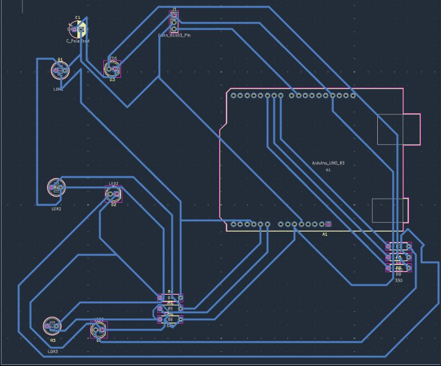
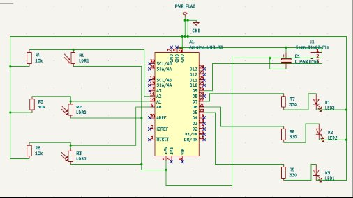

# 🅿️ SmartPark Pro — IoT-Based Smart Parking System

> **Final Year Project | Department of Electronics and Telecommunication Engineering**
> Don Bosco Institute of Technology, Mumbai (Affiliated to University of Mumbai)

**Team Members:**
| Role | Name |
|------|------|
| 👑 Leader | Piyush Keni |
| Member | Shivam Patil |
| Member | Rudra Pawar |
| Member | Indrajeet Kale |

---

## 📌 Project Overview

SmartPark Pro is a fully automated IoT-based parking management system that:
- Detects real-time slot availability using **LDR sensors**
- Reads vehicle number plates using **EasyOCR + OpenCV**
- Verifies bookings stored in **Google Sheets**
- Controls a **servo motor gate** (SG90) automatically
- Allows customers to **book slots online** via a web interface
- Syncs all data via **Google Apps Script**

---

## 🏗️ System Architecture

```
[Customer] → [index.html] → [Google Apps Script] → [Google Sheets]
                                                          ↑
[Camera] → [Python OCR] → [Plate Match] → [Arduino Serial]
                                                  ↓
                                    [Servo Gate + LEDs + LDRs]
```

---

## 🔧 Hardware Components

| Component | Quantity | Purpose |
|-----------|----------|---------|
| Arduino UNO R3 | 1 | Main controller |
| LDR (Light Dependent Resistor) | 3 | Slot occupancy detection |
| Servo Motor SG90 | 1 | Gate control |
| LED (with 330Ω resistors) | 3 | Slot indicator lights |
| 10kΩ Resistors | 3 | LDR voltage dividers |
| Capacitor (C_Polarized) | 1 | Power filtering |
| USB Camera / DroidCam | 1 | Number plate scanning |

---

## 🔌 Circuit Diagrams

### PCB Layout (KiCad)


### Schematic


---

## 📁 Repository Structure

```
SmartPark-Pro/
│
├── arduino/
│   └── smartpark_arduino_FIXED_v4.ino   # Arduino controller (gate + LDR + LED)
│
├── python/
│   └── smartpark_v3.py                  # OCR + Flask + Google Sheet sync
│
├── apps-script/
│   └── Code.gs                          # Google Apps Script (backend)
│
├── web/
│   ├── index.html                       # Customer booking page
│   └── workshop_dashboard.html          # Project dashboard page
│
├── hardware/
│   └── kicad/
│       ├── pcb_layout.png               # PCB layout screenshot
│       └── schematic.png                # Circuit schematic screenshot
│
└── README.md
```

---

## ⚙️ Setup Instructions

### Step 1 — Google Sheets & Apps Script

1. Go to [Google Sheets](https://sheets.google.com) → Create a new spreadsheet
2. Rename the first sheet to `Bookings`
3. Add headers in Row 1: `timestamp | user | car | slot`
4. Go to [script.google.com](https://script.google.com) → New Project
5. Paste the contents of `apps-script/Code.gs`
6. Set your `SECRET_TOKEN` (any random string, e.g. `smartpark_abc123`)
7. Click **Deploy → New Deployment → Web App → Anyone**
8. Copy the deployment URL

### Step 2 — Configure Python (`python/smartpark_v3.py`)

Open the file and fill in these placeholders at the top:

```python
SCRIPT_URL    = "YOUR_GOOGLE_APPS_SCRIPT_URL_HERE"       # From Step 1
SHEET_CSV_URL = "YOUR_GOOGLE_SHEET_CSV_EXPORT_URL_HERE"  # File → Share → Publish to web → CSV
SECRET_TOKEN  = "YOUR_SECRET_TOKEN_HERE"                  # Must match Code.gs token
ARDUINO_PORT  = "COM5"                                    # Change to your Arduino port
```

To get `SHEET_CSV_URL`: In Google Sheets → **File → Share → Publish to web → Sheet1 → CSV → Publish** → copy the URL.

### Step 3 — Configure HTML (`web/index.html`)

Open the file and fill in:

```javascript
const SCRIPT_URL = "YOUR_GOOGLE_APPS_SCRIPT_URL_HERE"; // Same URL from Step 1
// Also update the token inside confirmPay():
token: "YOUR_SECRET_TOKEN_HERE"  // Must match Code.gs token
```

### Step 4 — Install Python Dependencies

```bash
pip install opencv-python easyocr flask flask-cors pyserial pandas requests
```

### Step 5 — Upload Arduino Code

1. Open `arduino/smartpark_arduino_FIXED_v4.ino` in Arduino IDE
2. Select **Board: Arduino UNO** and correct **COM port**
3. Click **Upload**

### Step 6 — Run the System

```bash
cd python
python smartpark_v3.py
```

Then open `web/index.html` in a browser to make bookings.

---

## 🔐 Security Notes

- A **secret token** protects the Apps Script from unauthorized POST requests
- All credentials are stored as placeholders — **never commit real URLs or tokens**
- The `bookings.txt` file is local only and should **not** be uploaded to GitHub

---

## 🚀 How It Works

1. **Customer** opens `index.html`, selects a free slot, enters name + vehicle number, clicks **Confirm & Pay**
2. **Apps Script** saves the booking to Google Sheets
3. **Python** (running on PC) continuously scans camera feed for number plates using EasyOCR
4. When a plate matches a booking → Python sends the slot number to **Arduino via Serial**
5. **Arduino** opens the servo gate, lights the correct LED, and monitors the LDR
6. When the car leaves (LDR detects light) → Arduino sends `EMPTY:N` to Python
7. **Python** deletes the booking from Google Sheets and `bookings.txt`

---

## 📸 Screenshots

> *(Add screenshots of your web UI and camera feed here)*

---

## 📜 License

This project was developed for academic purposes at Don Bosco Institute of Technology, Mumbai.
Feel free to use and modify for educational purposes.
